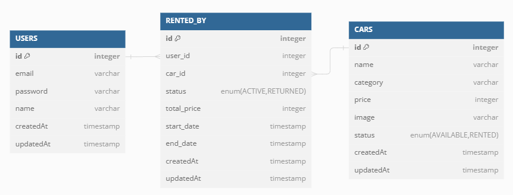

# Binar Car Rental - Admin Dashboard

Challenge for Chapter 5 FSW Class


## ERD




## Tech Stack

**Client:** HTML, CSS, Boostrap5

**Server:** Node, ExpressJS, Sequelize, Postgresql


## Environment Variables

To run this project, you will need to add the following environment variables to your .env file

`DB_USERNAME`
`DB_HOST`
`DB_PASSWORD`
`DB_NAME`
`DB_PORT`
`DB_DIALECT`
`SIGNATURE_KEY`
`BASE_URL`

## API Reference

#### Get all items

```http
  [POST] /users/register
```

| Body          | Type     | Description                |
| :------------ | :------- | :------------------------- |
| `email`       | `string` | Need '@gmail.com'          |
| `password`    | `string` | User's password for login  |
| `re_password` | `string` | Confirmation password      |
| `name`        | `string` | User's name                |


#### Get item

```http
  [POST] /users/login
```

| Body          | Type     | Description                |
| :------------ | :------- | :------------------------- |
| `email`       | `string` | Need '@gmail.com'          |
| `password`    | `string` | User's password for login  |

#### Create Order

```http
  [POST] /dashboard/create-order
```

| Body          | Type     | Description                |
| :------------ | :------- | :------------------------- |
| `user_id`     | `int`    | User's id                  |
| `car_id`      | `int`    | Car's id                   |
| `start_date`  | `date`   | format(YYYY-MM-DD)         |
| `end_date`    | `date`   | format(YYYY-MM-DD)         |

#### Login Page

```http
  [GET] BASE_URL/
```

#### Cars List Page

```http
  [GET] BASE_URL/cars/list
```

#### Create Car Form Page

```http
  [GET] BASE_URL/cars/form
```

#### Car Detail Page

```http
  [GET] BASE_URL/cars/detail/:id
```
| Parameter     | Type     | Description                |
| :------------ | :------- | :------------------------- |
| `id`          | `int`    | Car's id                   |

#### Edit Car Form Page

```http
  [GET] BASE_URL/cars/form/:id/edit
```
| Parameter     | Type     | Description                |
| :------------ | :------- | :------------------------- |
| `id`          | `int`    | Car's id                   |

#### Delete Car

```http
  [DELETE] BASE_URL/cars/:id
```
| Parameter     | Type     | Description                |
| :------------ | :------- | :------------------------- |
| `id`          | `int`    | Car's id                   |

#### Orders List Page (Dashboard Table)

```http
  [GET] BASE_URL/dashboard/orders-list
```

#### Cars List Page (Dashboard Table)

```http
  [GET] BASE_URL/dashboard/cars-list
```